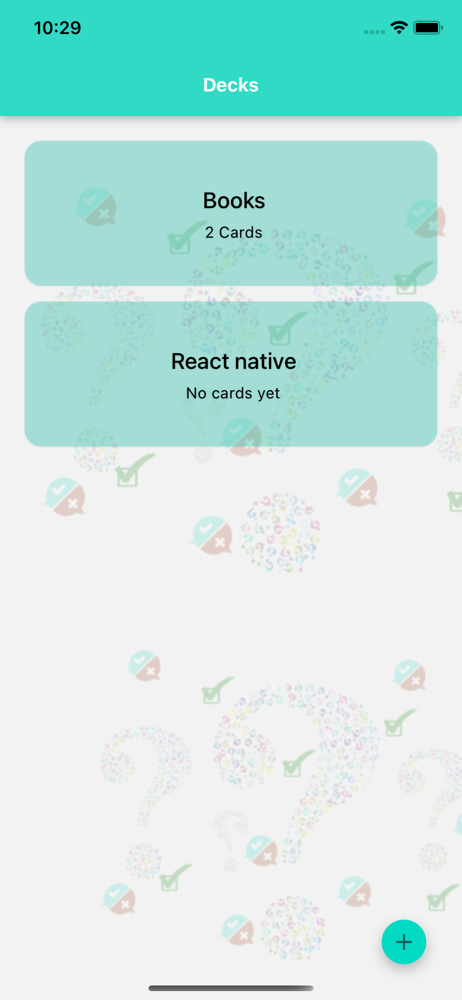
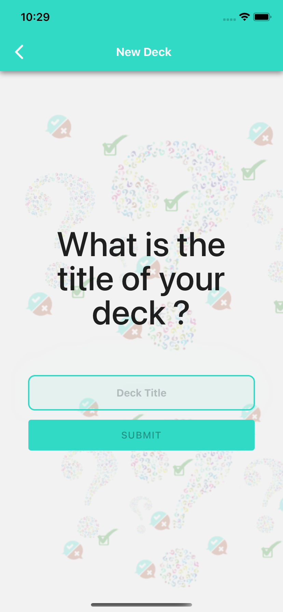
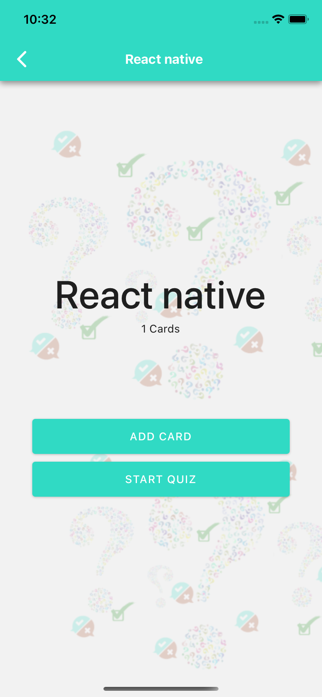
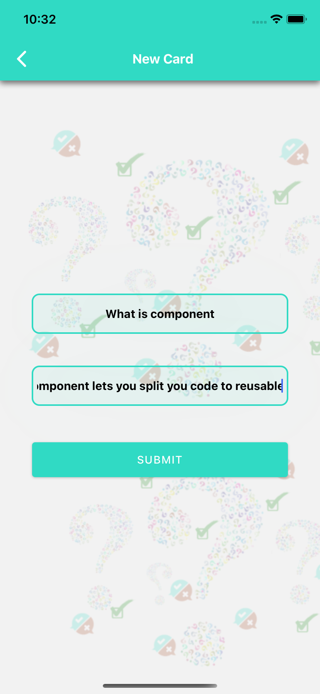
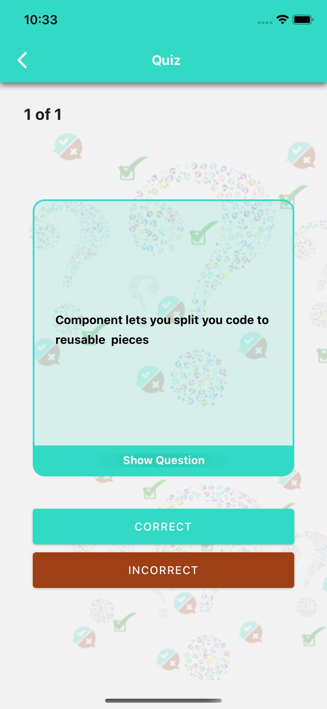
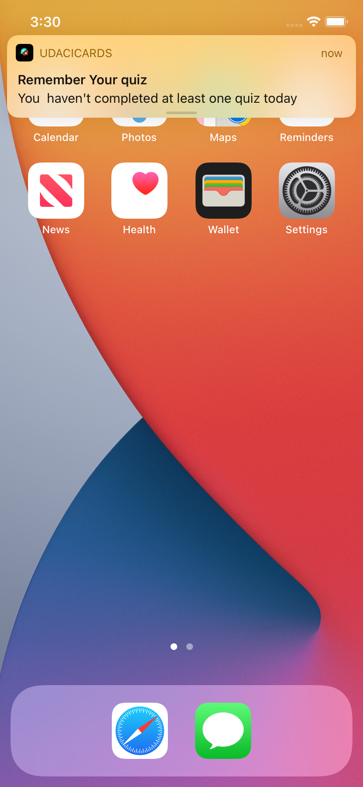

UdaciCards
===============================

This application is a part of Udacity React native course , it's a flash cards app 
  
## Features

 - User can open app and display his **decks**.
 - User can add **new decks**.
 - User can open any deck and **add cards** to the deck.
 - User can start a quiz on any deck with **answer hidden** of the current **qustion**.
 - User can show current question **answer**.
 - User can choose if his gessing is **correct** or **incorrect**.
 - User would find **result** with correct count of his quiz.
 - User will receive a **notification** if he do not take any quiz this day.
 

## Screens

|                                    |                                     |                                     |                                     |                                     |                                     |                                     |
| ---------------------------------  | --------------------------------    | --------------------------------    | --------------------------------    |--------------------------------    | --------------------------------    | --------------------------------    |
| | | |||||

### Application tested on both Android & IOS 